# Primer

Primer is the first OSM firmware fully customizable on-chip.

##  Installation

### Packaged release on Mac OS X

*  Download the latest .dmg from the releases tab.
*  Open the .dmg and double-click on "Upload .hex"

### Packaged release on Windows

* Download the latest .hex from the releases tab.
* Using XLoader, follow this tutorial on how to install.
  * Make sure to use 115200 for the speed.
  * Make sure to select "Uno(ATMega328)" from the Device dropdown.
  * Be sure to select the correct .hex file.

## Features

* **12** Fully Customizable
* **2** Variants Per Mode
* **4** Accelerometer Triggers to Switch Variants
* Each With **3** Sensitivity Levels
* **16** LED Animations For Your Variations
* **Up to 12** Colors Per Variation
* **62** Color + Blank Palette with **4** Shading Levels.
* **4** Customizable Bundles For Custom Mode Playlists
* Enable Conjuring Mode (Toggle On/Off With 1 Press) From Any Mode
* Easy To Use Customization Interface

## Controls

**Off**
* Press - Turn on. Go to **Play**.
* Hold 1.5s - Go to **Bundle Select**. Flashes blue.

**Bundle Select**
* Press - Cycle bundle.
* Hold 1.5s - Selects current bundle. Go to **Play**. Flashes blue.
* Hold 3.0s - Go to **Bundle Edit**. Flashes yellow.

**Bundle Edit**
* Press - Cycle bundle slot to next mode.
* Hold 1.5s - Sets current bundle slot to selected mode. Cycles to next bundle slot. Flashes magenta.
* Hold 3.0s - Saves bundle with current bundle slot as the end of the bundle. Go to **Play**. Flashes white.

**Play (Normal Mode)**
* Press - Cycle to next mode.
* Hold 1.0s - Put light to sleep. Flashes white.
* Hold 2.5s - Enables **Conjure Mode**. Flashes blue.
* Hold 4.0s - Go to **Config Select**. Flashes yellow.

**Play (Conjure Mode)**
* Press - Toggle light on/off (processor still running).
* Hold 1.0s - Turn off light and deactivate Conjure Mode. Flashes white.
* Hold 2.5s - Disable **Conjure Mode**. Flashes blue.
* Hold 4.0s - Go to **Config Select**. Flashes yellow.

**Config Select**
* Press - Cycle between configuration options. Color indicates what configuration mode will be selected.
  * Palette A - red
  * Palette B - blue
  * Prime A - magenta
  * Prime B - cyan
  * Accelerometer mode - green
  * Accelerometer sensitivity - yellow
* Hold 1.5s - Go to **Configure** for current configuration mode. Flashes yellow.
* Hold 3.0s - Go to **Play**. Flashes white.

**Config Palette**
* Press - Cycle forward through palette options.
* Dpress - Cycle backward through palette options.
* Hold 1.5s - Select color. Flashes white.
* Hold 1.5s more - Cycle to next shade. Flashes white.
* Release after hold - Go to **Confirm Color**.

**Confirm Color**
* Press - Accept color.
  * If last (12th) color slot, go to **Play** and save. Flashes white.
  * Otherwise just go to next color slot.
* Hold 1.5s - Reject color.
  * If first color slot, go to **Config Palette**. Flashes red.
  * Otherwise, go to **Confirm Color** for previous color slot. Flashes red.
* Hold 3.0s - Accept and save. Sets current color slot as last color. Go to **Play**. Flashes white.

**Config Prime**
* Press - Cycles to next prime.
* Hold 1.5s - Accept and save. Go to **Play**. Flashes white.

**Config Accelerometer Mode**
* Press - Cycle to next accelerometer mode. Color indicates what mode will be selected.
  * Off - dim white
  * Speed - red
  * Tilt X - blue
  * Tilt Y - yellow
  * Flip Z - green
* Hold 1.5s - Accept and save. Go to **Play**. Flashes white.

**Config Accelerometer Sensitivity**
* Press - Cycle to next accelerometer sensitivity. Color indicates what sensitivity will be selected.
  * Low - blue
  * Medium - magenta
  * High - red
* Hold 1.5s - Accept and save. Go to **Play**. Flashes white.

## Palette

**NOTE**: Colors displayed on the monitor differ from colors displayed on the light. These colors are approximations. Anything grey tends more to white than grey when shown on the LED.

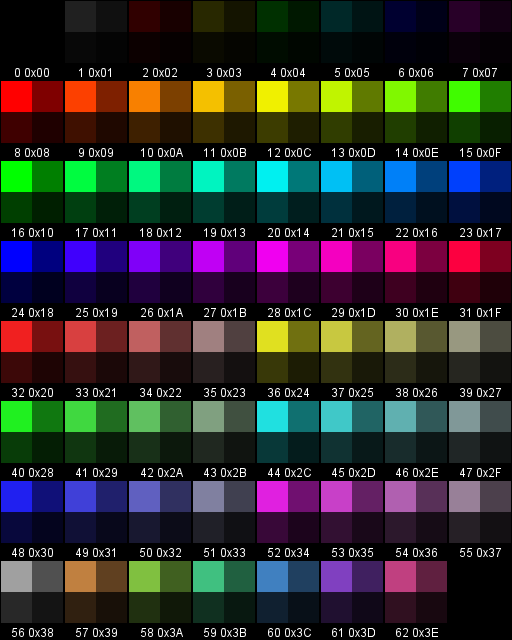

## Animations

These images represent the default mode set of animations. 1 pixel represents 0.5s of animation.

**NOTE**: Colors displayed on the monitor differ from colors displayed on the light. These colors are approximations. Anything grey tends more to white than grey when shown on the LED.

### Strobe
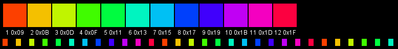

### Hyper
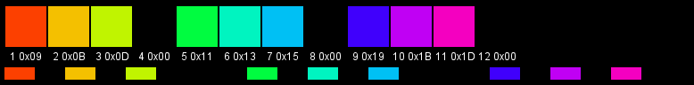

### Dops
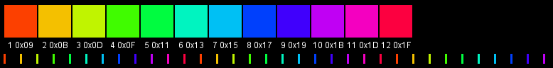

### Strobie
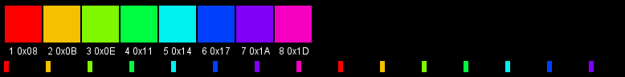

### Pulse
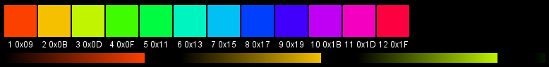

### Seizure

### Tracer
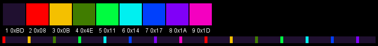

### Dash Dops
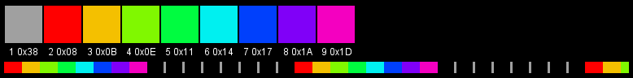

### Blink-E
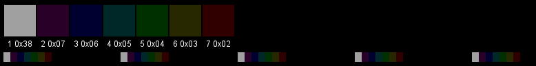

### Edge
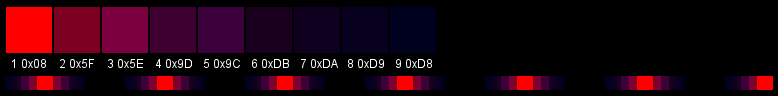

### Lego
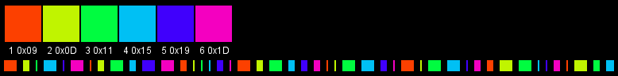

### Chase
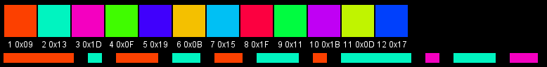

### Morph
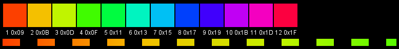

### Ribbon
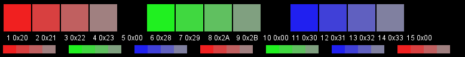

### Comet
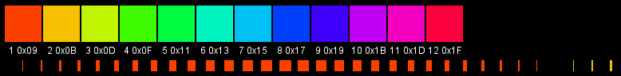

### Candy
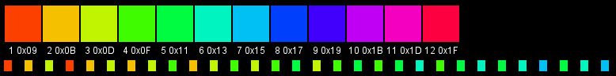

## Default Modes

**NOTE**: Colors displayed on the monitor differ from colors displayed on the light. These colors are approximations. Anything grey tends more to white than grey when shown on the LED.

### Mode 1
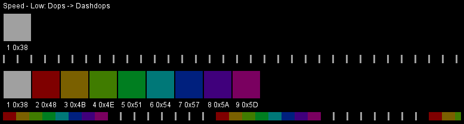

### Mode 2
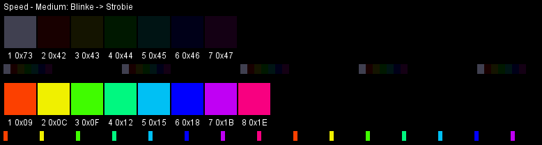

### Mode 3
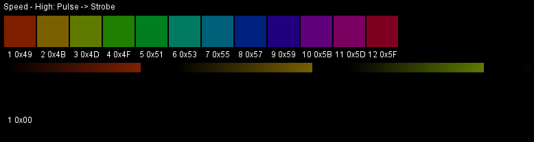

### Mode 4
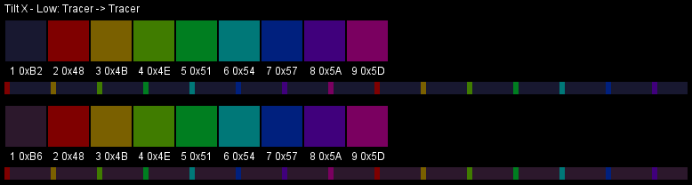

### Mode 5
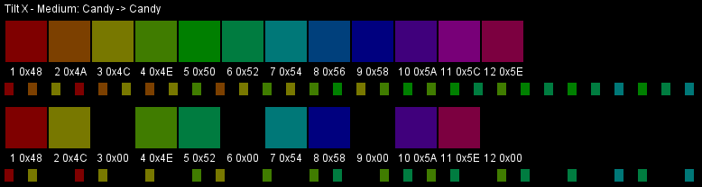

### Mode 6
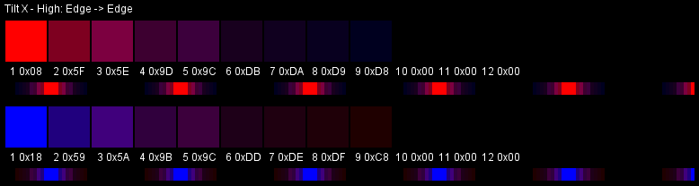

### Mode 7
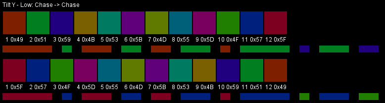

### Mode 8
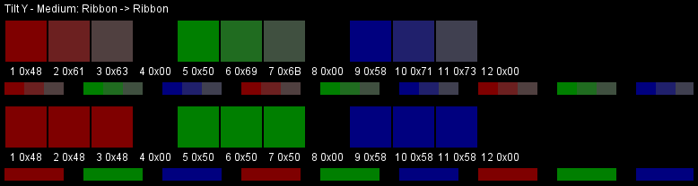

### Mode 9
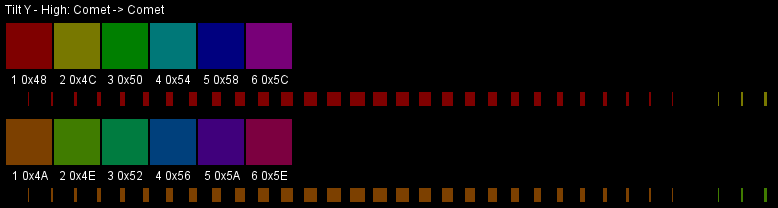

### Mode 10
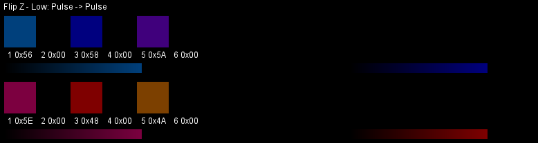

### Mode 11
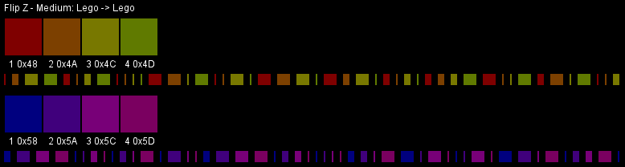

### Mode 12
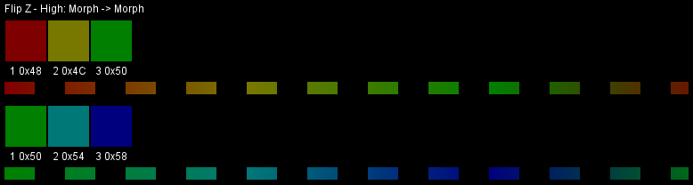
